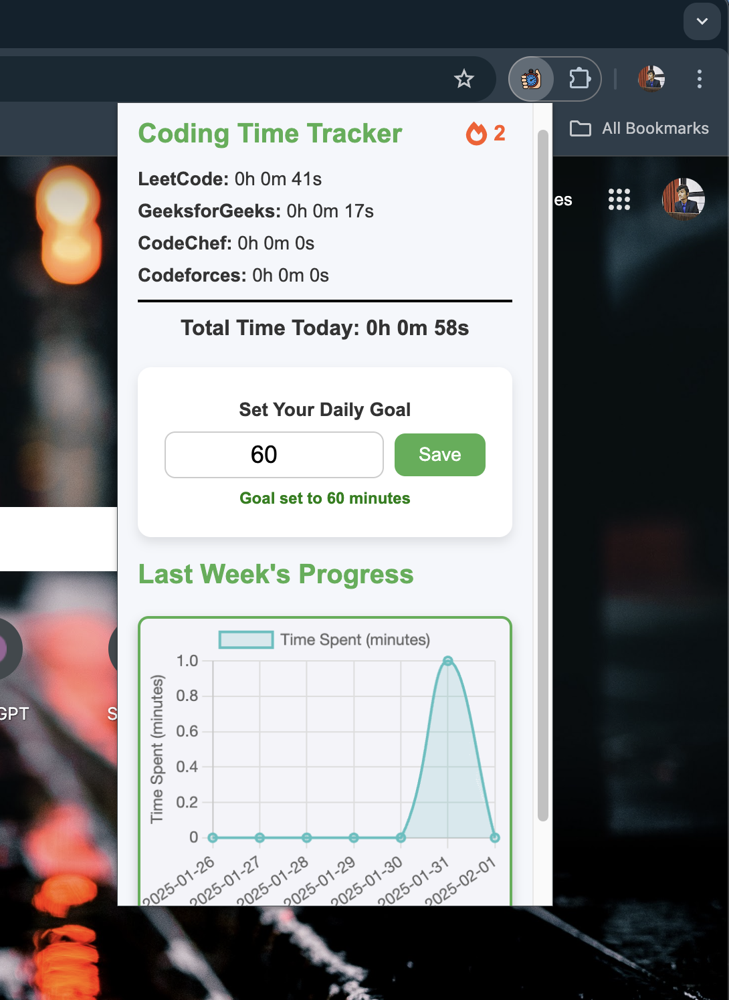

# Coding Time Tracker ⏳

  

Track and analyze your time spent on coding platforms like **LeetCode, CodeChef, GeeksforGeeks, and CodeForces** with interactive graphs, streak tracking, and daily goal reminders! 🚀  

## ✨ Features
- **📊 Analytics:** graphs to track progress.
- **🔥 Streaks:** See how many consecutive days you’ve coded.
- **🎯 Daily Goals:** Set targets and get alerts when you achieve them.  

## 🚀 Get Started
1. Clone the repo & load the extension.
2. Start tracking your coding time effortlessly!

---
